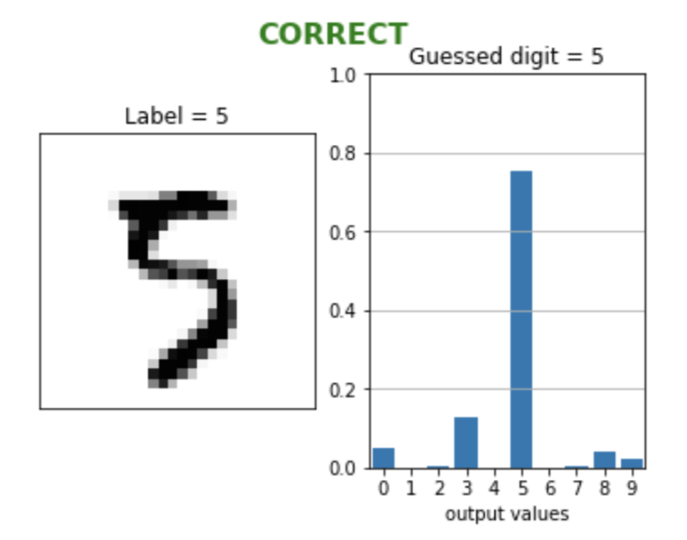

# Neural networks built from scratch

Presentation and dependencies
--------

The **[simple_nn.py](simple_nn.py)** Python code is an example of an artificial neural network model
written from scratch using only two packages from [pypi.org](https://pypi.org/):
- [numpy](https://numpy.org/) to manipulate arrays and compute matrix operations efficiently.
- [mnist](https://pypi.org/project/mnist/) to download and parse the dataset into training and testing sets with labels that can be used as numpy arrays.

The **[NN_1_hidden_layer.py](NN_1_hidden_layer.py)** is an improved version of the code using object-oriented programming. The structure of the network is the same. Additional functions are introduced to evaluate the performance of the network. Moreover this version does not use the [mnist](https://pypi.org/project/mnist/) package, but instead the raw files of the MNIST database (that can be downloaded at http://yann.lecun.com/exdb/mnist/) are used. The imports in this code are:
- [numpy](https://numpy.org/)
- [struc](https://docs.python.org/3/library/struct.html) and [array](https://docs.python.org/3/library/array.html) to convert the raw data of the database into numpy arrays. These two modules are already contained in Python (no need to download them).
- [matplotlib](https://matplotlib.org) to plot and illustrate the performance of the network.

The networks are trained to classify handwritten digits using the MNIST database. Here is an extract of some MNIST images:

The **[simple_nn_test.ipynb](simple_nn_test.ipynb)** contains a demo of how to use the **[simple_nn.py](simple_nn.py)** file to train and test the network's performance. There are also explanations of how the network works and is trained using gradient descent. In this file we use the [matplotlib](https://matplotlib.org) package to illustrate the dataset inputs and the results of the network.

An illustration of the output of the network for a given input image:

Structure of the neural network
--------

This is a forward propagating network with 3 layers :
- the input layer has 784 nodes (28 x 28 input images are flattened)
- the hidden layer has 16 nodes
- the output layer has 10 nodes

Activation functions used:
- Sigmoid for the hidden layer
- Softmax for the output layer

The loss is calculated with cross entropy.

Usage guide of the [simple_nn.py](simple_nn.py) functions
--------

1.  Run the ***train()*** function to train the neural network.
    This function executes 200 iterations.
    For each iteration a batch of 32 images is processed.
    At the end of each iteration the weights and biases are updated.
    
2.  Run the ***accuracy()*** function to see the network's performance.

3.  Feel free to change the network's parameters and try to improve accuracy.
