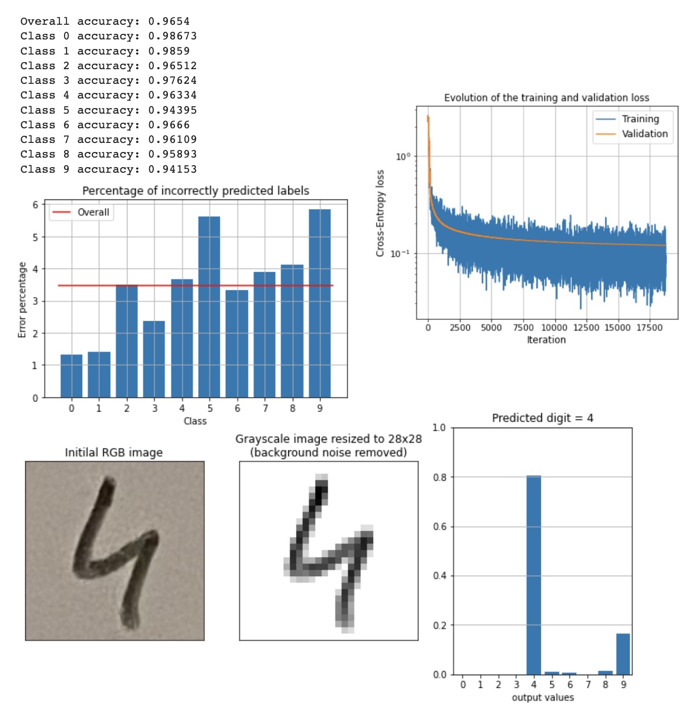

# My first Neural Networks built from scratch

Presentation and dependencies
--------

The **[simple_nn.py](simple_nn.py)** Python code is a feedforward neural network model, with one hidden layer, written from scratch using only two packages [numpy](https://numpy.org/) and [mnist](https://pypi.org/project/mnist/) to download the training and testing sets.

The **[one_hidden_layer_nn.py](one_hidden_layer_nn.py)** is an improved version of the code using object-oriented programming. The structure of the network is the same. Additional functions are introduced to evaluate the performance of the network. Moreover this version does not use the [mnist](https://pypi.org/project/mnist/) package, but instead the raw files of the MNIST database (that can be downloaded at http://yann.lecun.com/exdb/mnist/) are used.

Even better, **[custom_nn.py](custom_nn.py)** can create and train feedforward neural networks with a custom number of layers (depth) each with a custom size (width). The code used for the forward and backpropagation is also improved to make the training faster.

The networks are trained to classify handwritten digits using the MNIST database. Here is an extract of some MNIST images:

The **[simple_nn_test.ipynb](simple_nn_test.ipynb)** contains a demo of how to use the **[simple_nn.py](simple_nn.py)** file to train and test the network's performance. There are also explanations of how the network works and is trained using gradient descent. An illustration of the output of the network:

For the **[custom_nn_test.ipynb](custom_nn_test.ipynb)**, the dimensions of the network tested are 784 (for the input), 128 (first hidden layer), 32 (second hidden layer) and 10 (output). Here are some results as well as a test on my own handwritten digit:

Structure of the [simple_nn.py](simple_nn.py)
--------

This is a fully connected forward propagating network with 3 layers :
- the input layer has 784 nodes (28 x 28 input images are flattened)
- the hidden layer has 16 nodes
- the output layer has 10 nodes

Activation functions used:
- Sigmoid for the hidden layer
- Softmax for the output layer

The loss is calculated with cross entropy.

Usage guide of the [simple_nn.py](simple_nn.py) functions
--------

1.  Run the ***train()*** function to train the neural network.
    This function executes 200 iterations.
    For each iteration a batch of 32 images is processed.
    At the end of each iteration the weights and biases are updated.
    
2.  Run the ***accuracy()*** function to see the network's performance.

3.  Feel free to change the network's parameters and try to improve accuracy.
